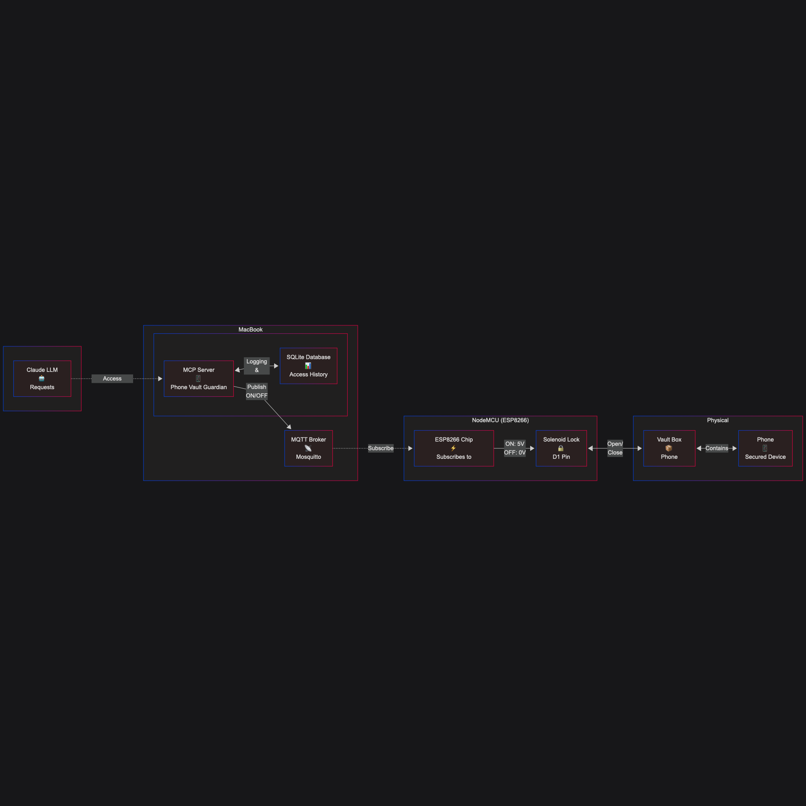

# Phone Vault Guardian

A system to enforce digital discipline by physically locking away your phone and requiring justification for access. The project combines a Python backend, an SQLite event log, and a NodeMCU-based relay controlled via MQTT.

---

## Features

- **Physical Phone Vault**: Uses a relay and NodeMCU to lock/unlock a phone vault.
- **Access Control**: Requires justification and intended use before unlocking.
- **Usage Logging**: All access events are logged in an SQLite database.
- **Discipline Tools**: Provides digital wellness questions and generates a phone usage contract.
- **MQTT Communication**: Securely controls the relay via MQTT messages.

---

## Process Flow

1. **User requests phone access** via the Python server.
2. **Server prompts for justification and intended use**.
3. **Server evaluates request** (optionally with discipline questions).
4. **If approved**, server sends MQTT message to NodeMCU to unlock the vault.
5. **NodeMCU activates relay**, unlocking the vault.
6. **All events are logged** in the database for review and statistics.
7. **Vault can be re-secured** via the server, which sends another MQTT message.

---

## Process Flow Diagram



---

## Getting Started

### Prerequisites

- Python 3.10+
- NodeMCU (ESP8266/ESP32)
- MQTT broker (e.g., Mosquitto)
- Relay module
- SQLite3

### Installation

1. **Clone the repository** and install dependencies

2. **Configure the NodeMCU**:
    - Edit `mqtt-solenoid.ino` with your WiFi and MQTT broker details.
    - Flash to your NodeMCU.

3. **Start the MQTT broker** (e.g., Mosquitto):
    ```bash
    mosquitto
    ```

4. **Run the server**:
    ```bash
    uv run mcp install server.py
    ```

---

## Usage

- Use the server’s tools to:
    - Check phone access history
    - Unlock or secure the vault
    - Get discipline questions
    - Generate a phone usage contract

---

## File Structure

- `server.py` — Main backend logic and event logging
- `mqtt-solenoid.ino` — NodeMCU firmware for relay control
- `process-flow.png` — Process flow diagram
- `phone_vault_history.db` — SQLite event log

---

## License

MIT

---

## Acknowledgements

- [Pydantic](https://pydantic-docs.helpmanual.io/)
- [Mosquitto MQTT](https://mosquitto.org/)
- [ESP8266/ESP32 Arduino Core](https://github.com/esp8266/Arduino)